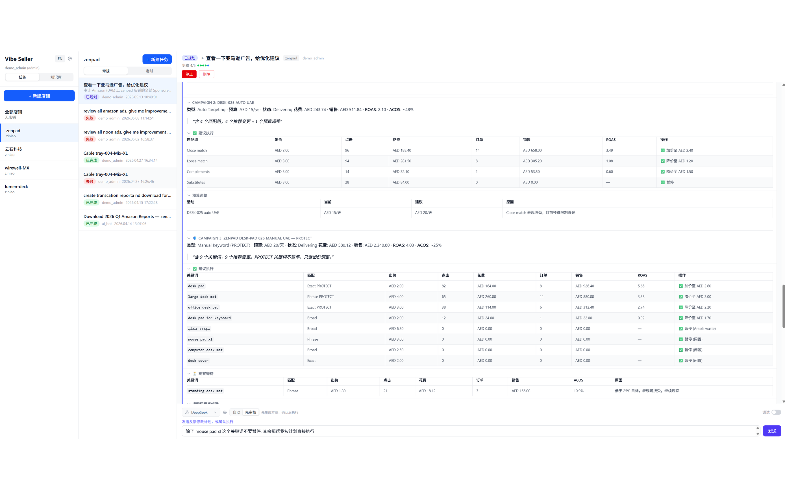
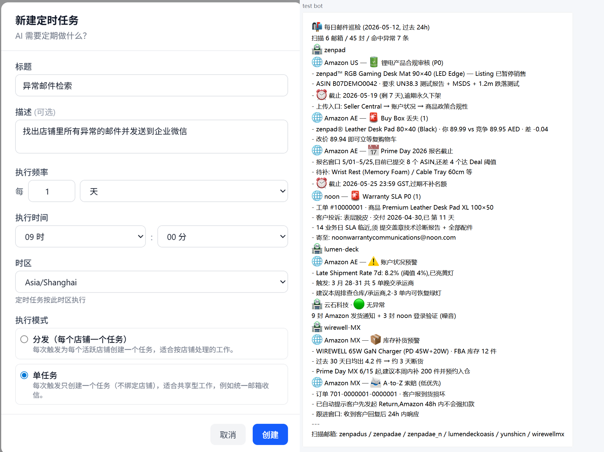
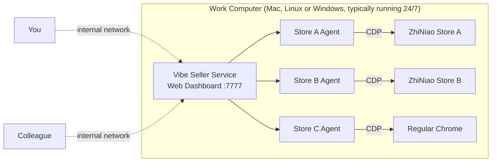
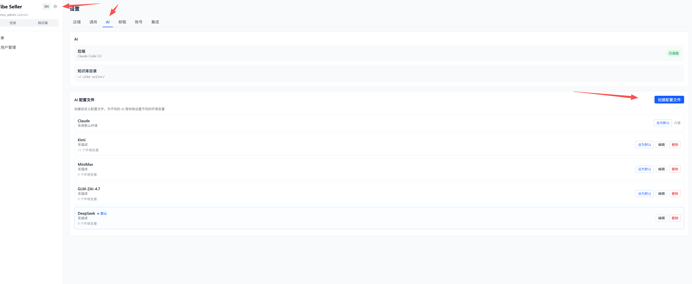
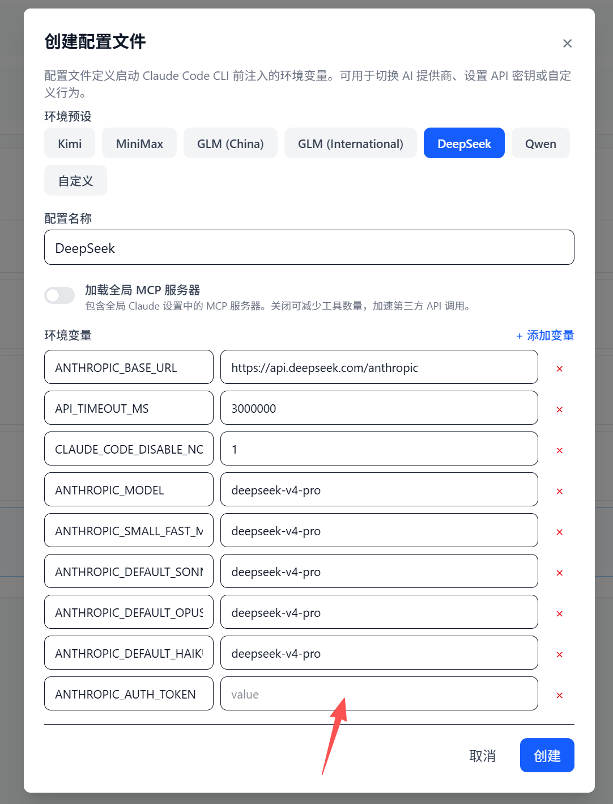
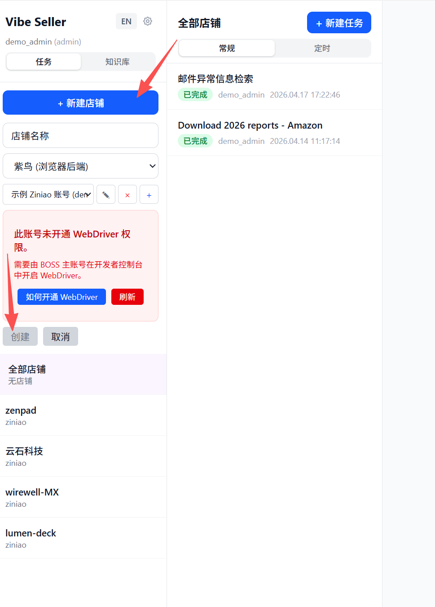
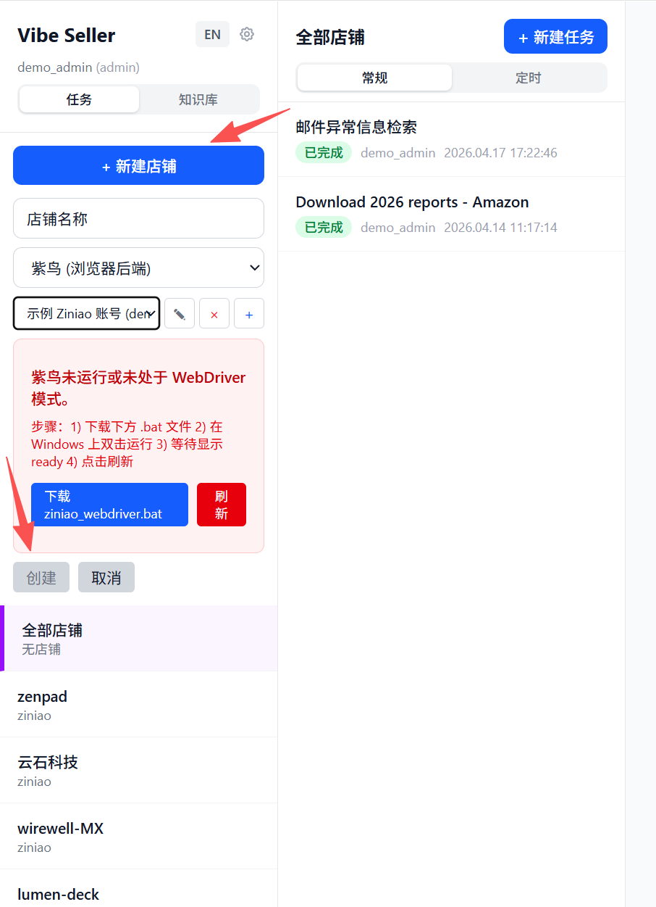

```markdown
# Vibe Seller

<p align="center">
  <b>AI Automation Framework for Cross-Border Sellers (Supports Amazon, Noon, Zando, Baishun platforms, ZhiNiao and Chrome browsers), Free Integration with Any Large Model<br/>
  Supports macOS, Linux, Windows (native installer) · Fully locally deployed, code and data are all on your own machine · Compatible with Claude / DeepSeek / GLM / Qwen / Kimi / MiniMax and other mainstream models
</p>

<p align="center">
  <a href="README_en.md">English</a> ·
  <a href="README.md">中文</a>
</p>


<p align="center"></p>






---

## What is this

Vibe Seller is a **browser automation framework** for cross-border sellers, locally deployed. Agents drive ZhiNiao (or regular Chrome) browsers via CDP (Chrome's underlying remote control protocol) — just like you manually clicking through pages — for ad optimization, listing uploads, listing inspection, inventory checks, invoice downloads, warehouse setup and receiving, logistics tracking, and more — anything that can be done in a browser can be done by Agents.

Each store runs its own — **like you've hired several independent operators**: Store A's Agent only monitors Store A's ZhiNiao profile, with its own memory and workspace, completely isolated from Store B and Store C's Agents, with no data cross-contamination.



Two deployment methods are supported:

- **A work computer kept running** 24/7 with Vibe Seller service
- **Or just use your own computer**

You and your colleagues can browse the web dashboard from any device within your internal network.

## Why Use Vibe Seller

Compared to existing automation tools, Vibe Seller better meets the actual needs of cross-border sellers and aligns more closely with what AI technology can currently achieve: it's AI-driven from the ground up — built-in Skills, multi-store isolation, fully local deployment. Browser operations are based on [browser-use](https://github.com/browser-use/browser-use) rather than image-based clicking — much faster than having Agents figure out pages from scratch, and more token-efficient.

- **Ready to use, no training required** — built-in Skills for Amazon (all marketplaces), Noon and other platforms cover the core tasks sellers need: reports/statement exports, listing uploads and updates, ad optimization. After creating a task, the system automatically opens a browser (ZhiNiao or regular Chrome), and the Agent gets to work — usually completing it in one go, no guided step-by-step operation needed.
- **Native ZhiNiao support** — directly controls ZhiNiao via CDP, not raw Chrome with Playwright or coordinate-based UI clicking, so lower risk of detection, more stable.
- **Browser-agnostic** — besides ZhiNiao, regular Chrome is also a first-class citizen, each store can choose its preferred browser.
- **Supports most major models** — runs on Claude Code CLI, any supplier compatible with Anthropic protocol can be integrated: Claude, DeepSeek, Kimi, MiniMax, GLM, Qwen. Simply switch in settings, no code changes needed. API keys are self-provided.
- **No SaaS binding** — code runs on your machine, data stays on your disk, no account registration required.
- **Auditable** — every operation, every Prompt, every screenshot is logged, replayable, any issues can be traced back.
- **Naturally multi-store isolated** — each store has its own platform, data, SOPs, and accumulated experience. Store A runs Amazon US, Store B runs Noon EG, Store C runs Shopify standalone store — three stores running in parallel, completely isolated.

## Installation

### Requirements

- Any LLM API Key: Claude / DeepSeek / Kimi / MiniMax / GLM / Qwen
- Browser engine — Chrome or ZhiNiao

### Quick Start — Choose Your System

<details open>
<summary><b>🪟 Windows — NATIVE Installer (Recommended)</b></summary>

No WSL, no Python configuration. From the [latest release](https://github.com/zpoint/vibe-seller/releases/latest) download **`VibeSeller-Setup.exe`** and double-click to run.

Or in **PowerShell**:

```powershell
irm https://raw.githubusercontent.com/zpoint/vibe-seller/main/installer/windows/install.ps1 | iex
```

</details>

<details open>
<summary><b>🍎 macOS / 🐧 Linux</b></summary>

```bash
curl -sSL https://raw.githubusercontent.com/zpoint/vibe-seller/main/install.sh | bash
vibe-seller start
```

Open <http://localhost:7777>. Upgrade: `vibe-seller upgrade`. Uninstall: `uv tool uninstall vibe-seller`.

<sub>Requirements (handled automatically by `install.sh`): Python 3.11+ (via <a href="https://docs.astral.sh/uv/"><code>uv</code></a>), Node.js 22+.</sub>

</details>

<details>
<summary>🪟 Windows via WSL2 (Advanced)</summary>

Prefer the native installer above. WSL2 option runs the service in Ubuntu/WSL while browser runs on Windows host — requires **mirrored network mode** (Windows 11+ only). See [developer guide](docs/dev-guide.md) for full steps.

```bash
# In WSL2 Ubuntu
curl -sSL https://raw.githubusercontent.com/zpoint/vibe-seller/main/install.sh | bash
vibe-seller start
```

</details>

<details>
<summary>Clone from source (for contribution/二次开发)</summary>

```bash
git clone https://github.com/zpoint/vibe-seller
cd vibe-seller
./install.sh --dev   # Install system dependencies + venv + build frontend + Playwright
./start.sh           # Starts service on :7777
```

</details>

> If `install.sh` errors, give the GitHub project link <https://github.com/zpoint/vibe-seller> to any coding Agent (Claude Code / Codex / opencode / Cursor), tell it "Read the README and help me install it" — it will look through the docs, run commands, and fix most environment issues in one or two steps.

## Initial Configuration

<details>
<summary><b>🪟 Windows — Initial Setup (4 Steps)</b></summary>

Following the [native installer](#installation) steps:

### 1. Install

Run [`VibeSeller-Setup.exe`](https://github.com/zpoint/vibe-seller/releases/latest) (or the PowerShell one-liner above). After installation, the service starts automatically — check "Open Vibe Seller now" at the end of the installer, or manually open <http://localhost:7777>.

### 2. Enter LLM Key

`Settings → AI Agent` → Choose a provider (DeepSeek supports pay-as-you-go, Claude has high limits, Kimi/MiniMax/GLM/Qwen also supported), paste API Key and save. Keys are locally encrypted and stored.

> **No Key?** The easiest is [DeepSeek](https://platform.deepseek.com/) — register on the official website, charge 15-20 CNY and start running, pay-as-you-go pricing (cost varies by task complexity). Other providers usually require prepaid token packages — buy according to your needs.

> If you've already logged into Anthropic subscription on this machine? Vibe Seller will directly reuse that session, skip this step.





### 3. Bind Stores

`Settings → Stores → Add ZhiNiao Account`, fill in account info, select the corresponding ZhiNiao profile for each store, and save. If you don't use ZhiNiao, you can opt for regular Chrome.



### 4. Create First Task

On the home page, click "New Task" → Select a store → Tell the Agent what to do in one sentence:

- "Check ads and pause keywords with ACOS over 30%"
- "Export sales report from the past 7 days"
- "Check inventory and estimate which SKUs need replenishment next month"

The Agent plans steps, operates the browser, and provides a result report at the end. Default Auto mode runs directly; switch to Plan mode at the bottom of the task details to have the Agent first show you its plan for approval.

> Want to integrate email / WeCom / TickTick / Google Workspace? Configure it in `Settings → Integrations` without affecting your ability to complete the first task.

</details>

<details>
<summary><b>🍎 macOS / 🐧 Linux — Initial Setup (8 Steps)</b></summary>

Even if you've never used command line, you can follow along. Total of 8 steps:

### 1. Open Terminal

On Mac, press ⌘ + space, type "Terminal", press Enter. On Linux, open your usual terminal app.

A black terminal with white text will appear, with a blinking cursor — that's the terminal.

### 2. Install

Copy and paste the entire line below into the terminal, press Enter:

```bash
curl -sSL https://raw.githubusercontent.com/zpoint/vibe-seller/main/install.sh | bash
```

It will run for a few minutes (downloading Python toolchain, installing Vibe Seller, pulling Chromium). When you see `Vibe Seller installed!` at the end, you're done.

If it gets stuck or errors? Give the GitHub project link <https://github.com/zpoint/vibe-seller> to any coding Agent (Claude Code, Codex, opencode, Cursor), tell it "Read README and install this for me", it will run commands to fix it.

### 3. Start

```bash
vibe-seller start
```

The service runs in the background, terminal prints PID and log path — you can close the terminal now, the service won't stop. To stop it, use `vibe-seller stop`.

### 4. Open Browser

In your browser, enter:

```
http://localhost:7777
```

If you see the Vibe Seller homepage (no login required by default), installation succeeded.

### 5. Enter LLM Key

`Settings → AI Agent` → Choose a provider (DeepSeek supports pay-as-you-go, Claude has high limits, Kimi/MiniMax/GLM/Qwen also supported), paste API Key and save. Keys are locally encrypted and stored.

> **No Key?** The easiest is [DeepSeek](https://platform.deepseek.com/) — register on the official website, charge 15-20 CNY and start running, pay-as-you-go pricing (cost varies by task complexity). Other providers usually require prepaid token packages — buy according to your needs.

> If you've already logged into Anthropic subscription on this machine? Vibe Seller will directly reuse that session, skip this step.

> **Using cc-switch or similar Claude account-switching tools?** Please select default here.

These tools directly modify your global config file `~/.claude/settings.json` to switch AI providers, conflicting with this project's AI selector. Just choose default, let cc-switch handle AI switching.

If you want this project to manage it instead: Exit cc-switch, then copy and paste the line below into the terminal:

```bash
python3 -c "import json,pathlib;p=pathlib.Path.home()/'.claude'/'settings.json';d=json.loads(p.read_text());env=d.get('env') or {};[env.pop(k,None) for k in list(env) if k.startswith('ANTHROPIC_')];d['env']=env;p.write_text(json.dumps(d,indent=2))"
```

It modifies your Claude Code global config (`~/.claude/settings.json`), removing `ANTHROPIC_*` environment variables added by cc-switch.


### 6. Bind Stores

`Settings → Stores → Add ZhiNiao Account`, fill in account info, select the corresponding ZhiNiao profile for each store, and save. If you don't use ZhiNiao, you can opt for regular Chrome.


### 7. (Optional) Configure Email / WeCom

Want Agent to automatically send inspection reports via email or push anomalies to WeCom group? Add in `Settings → Integrations`:

- **Email**: Fill in the email address corresponding to each store. IMAP server is auto-detected (gmail / outlook / self-hosted all supported), you only need to fill in the secrets (application password / app password). Don't know how to generate it? Ask any AI with the email provider's name. After saving, Agent will automatically scan once a day.
- **WeCom**: Create a group robot, paste the webhook URL. Important anomalies are automatically pushed to the group.
- **TickTick / Google Workspace**: If you want to sync results to calendar or documents, you can connect here.

Skipping is fine, just complete the first task.

### 8. Create First Task

On the home page, click "New Task" → Select a store → Tell the Agent what to do in one sentence:

- "Check ads and pause keywords with ACOS over 30%"
- "Export sales report from the past 7 days"
- "Check inventory and estimate which SKUs need replenishment next month"

The Agent plans steps, operates the browser, and provides a result report at the end. Default Auto mode runs directly; switch to Plan mode at the bottom of the task details to have the Agent first show you its plan for approval.

</details>

<details>
<summary><b>🐧 Windows via WSL2 — Initial Setup (8 Steps)</b></summary>

Even if you've never used command line, you can follow along. Total of 8 steps. Prerequisite: already installed via [WSL2 method](#installation) (requires mirrored network mode, Windows 11+ only).

### 1. Open Terminal

Open Ubuntu terminal in WSL — search "Ubuntu" in Start Menu, or input `wsl` in PowerShell.

A black terminal with white text will appear, with a blinking cursor — that's the terminal.

### 2. Install

Copy and paste the entire line below into the terminal, press Enter:

```bash
curl -sSL https://raw.githubusercontent.com/zpoint/vibe-seller/main/install.sh | bash
```

It will run for a few minutes (downloading Python toolchain, installing Vibe Seller, pulling Chromium). When you see `Vibe Seller installed!` at the end, you're done.

If it gets stuck or errors? Give the GitHub project link <https://github.com/zpoint/vibe-seller> to any coding Agent (Claude Code, Codex, opencode, Cursor), tell it "Read README and install this for me", it will run commands to fix it.

### 3. Start

```bash
vibe-seller start
```

The service runs in the background, terminal prints PID and log path — you can close the terminal now, the service won't stop. To stop it, use `vibe-seller stop`.

### 4. Open Browser

In your browser, enter:

```
http://localhost:7777
```

If you see the Vibe Seller homepage (no login required by default), installation succeeded.

### 5. Enter LLM Key

`Settings → AI Agent` → Choose a provider (DeepSeek supports pay-as-you-go, Claude has high limits, Kimi/MiniMax/GLM/Qwen also supported), paste API Key and save. Keys are locally encrypted and stored.

> **No Key?** The easiest is [DeepSeek](https://platform.deepseek.com/) — register on the official website, charge 15-20 CNY and start running, pay-as-you-go pricing (cost varies by task complexity). Other providers usually require prepaid token packages — buy according to your needs.

> If you've already logged into Anthropic subscription on this machine? Vibe Seller will directly reuse that session, skip this step.

> **Using cc-switch or similar Claude account-switching tools?** Please select default here.

These tools directly modify your global config file `~/.claude/settings.json` to switch AI providers, conflicting with this project's AI selector. Just choose default, let cc-switch handle AI switching.

If you want this project to manage it instead: Exit cc-switch, then copy and paste the line below into the terminal:

```bash
python3 -c "import json,pathlib;p=pathlib.Path.home()/'.claude'/'settings.json';d=json.loads(p.read_text());env=d.get('env') or {};[env.pop(k,None) for k in list(env) if k.startswith('ANTHROPIC_')];d['env']=env;p.write_text(json.dumps(d,indent=2))"
```

It modifies your Claude Code global config (`~/.claude/settings.json`), removing `ANTHROPIC_*` environment variables added by cc-switch.


### 6. Bind Stores

`Settings → Stores → Add ZhiNiao Account`, fill in account info, select the corresponding ZhiNiao profile for each store, and save. If you don't use ZhiNiao, you can opt for regular Chrome.

ZhiNiao is installed on the Windows side, Vibe Seller runs on the WSL side. ZhiNiao can only run one mode at a time, Vibe Seller requires Developer mode (also called WebDriver mode — this mode opens CDP). WSL cannot directly restart ZhiNiao on Windows, so you need a `.bat` launcher on the Windows side:

1. Download `ziniao_webdriver.bat` from `Settings → Stores → Download Launcher`.
2. Double-click to run on Windows.
3. Back to Vibe Seller on WSL, click the "refresh" button on the ZhiNiao page, accounts will auto-appear, no manual input required.



### 7. (Optional) Configure Email / WeCom

Want Agent to automatically send inspection reports via email or push anomalies to WeCom group? Add in `Settings → Integrations`:

- **Email**: Fill in the email address corresponding to each store. IMAP server is auto-detected (gmail / outlook / self-hosted all supported), you only need to fill in the secrets (application password / app password). Don't know how to generate it? Ask any AI with the email provider's name. After saving, Agent will automatically scan once a day.
- **WeCom**: Create a group robot, paste the webhook URL. Important anomalies are automatically pushed to the group.
- **TickTick / Google Workspace**: If you want to sync results to calendar or documents, you can connect here.

Skipping is fine, just complete the first task.

### 8. Create First Task

On the home page, click "New Task" → Select a store → Tell the Agent what to do in one sentence:

- "Check ads and pause keywords with ACOS over 30%"
- "Export sales report from the past 7 days"
- "Check inventory and estimate which SKUs need replenishment next month"

The Agent plans steps, operates the browser, and provides a result report at the end. Default Auto mode runs directly; switch to Plan mode at the bottom of the task details to have the Agent first show you its plan for approval.

</details>

## What It Can Do

Vibe Seller is an **AI Agent framework**, with browser just being one of its tools. The Agent can browse pages, read your email, send to WeCom, write Todoist tasks, modify Google Docs — anything that fits "see → judge → act", use browser where available, directly call integration APIs otherwise.

Common scenarios in cross-border operations:

| Task | What Agent Does |
|---|---|
| **Ad Optimization** | Navigate Campaign Manager, identify high-cost/low-performing campaigns, propose bid/budget adjustments, apply changes after approval. |
| **Listing Upload** | Create new listings per template: title, selling points, images, A+, variants all in one. |
| **Listing Inspection** | Traverse all stores, flag unsold/out-of-stock/anomalous SKUs. |
| **Inventory Check** | Pull live inventory, directly notify WeCom for low-stock SKUs. |
| **Warehouse Setup / Receiving** | Create inbound orders, assign FBA/FBN, print box labels. |
| **Logistics Data Query** | Track shipments, check transit times and customs clearance progress; automatically create TickTick tasks for delayed orders. |
| **Invoices & Reports** | Fetch invoice data, Business Reports, Ad Reports; auto-archive to Google Drive after completion. |
| **Email Processing** | Classify buyer emails, forward important ones to WeCom, draft reply suggestions. |
| **Whatever you can think of** | Write a Skill (markdown step-by-step instructions), or let Agent do it once — it'll take notes, next time follow your preferences automatically. |

Advertising optimization typically takes 3–5 minutes, LLM cost around ¥1 (DeepSeek, varies by ad volume).

## Integrated Services

Besides browser, Agents can directly call the following external services (simply mount permissions in initial setup, no coding required):

| Service | What It Does |
|---|---|
| **Email** (IMAP/SMTP) | Read emails from bound store accounts, classify and forward, draft replies |
| **WeCom** (Enterprise WeChat) | Push important events, cross-group notifications, forward buyer inquiries |
| **Todoist / TickTick** | Automatically create tasks (tracking, follow-ups, periodic checks) |
| **Google Workspace** | Gmail, Drive, Docs, Sheets, Slides, Calendar — read, write, edit all supported |

A single task can use both browser + these services. For example, "Find all slow-moving SKUs across stores" can run: browser fetches inventory → generates Google Sheet report → sends summary to WeCom → creates a "price drop next week" task in Todoist.

## Supported Platforms

### Platforms with Built-in Skills

- **Amazon Seller Central** (all sites: US, EU, MENA)
- **Noon Seller Lab**

These two platforms were personally tested by developers, with page mechanisms, navigation paths, and UI pitfalls fully documented in Skills. Agents reading Skills + your task Prompt can **generally succeed in one try** for common operations (viewing ads, exporting reports, price adjustments, uploads, etc.).

### Other Platforms via Browser

- ZhiNiao (Mercado Libre), AliExpress (AliExpress), Shopify
- Lazada, Shopee, TikTok Shop
- … and any seller backend accessible via browser.

Developers don't have test accounts for these platforms, so pre-written Skills aren't available. First run on a new platform may be trial-and-error, requiring a few attempts to learn the workflow.

**However, the framework has built-in "self-learning"**: Agents automatically take notes while running — incorrect button clicks, successful workflows, discovered pitfalls are all saved to each store's local knowledge base. This process **doesn't require you to supervise** — Agents run and learn independently. Even if you provide occasional human hints, those are captured too. Next time running the same task, previous experience is directly reused, avoiding repeated mistakes. After several rounds, even new platforms stabilize common operations.

Once stable, welcome to organize experiences into formal Skills for project contribution (PR links below "Contributing Code").

## Service Management

```bash
./start.sh          # default :7777
./start.sh 8080     # specify port
./stop.sh           # stop
./restart.sh        # restart
```

Want colleagues to access via internal network? Have them open `http://<your computer IP>:7777`.

## Troubleshooting

<details>
<summary><b>How much does it cost?</b></summary>

Vibe Seller itself is free and open-source, only costs you your own LLM API Key — paid directly to the provider. Roughly: one ad optimization task costs ~¥1 (DeepSeek, varies by ad count).

</details>

<details>
<summary><b>Which LLM should I choose?</b></summary>

Different tasks have vastly different requirements for model reasoning capability — recommended selection by task type:

| Task Type | Recommended Models |
|---|---|
| **Simple Tasks** — email classification, fixed-process data extraction, form filling | MiniMax, Kimi, GLM, Qwen all work, pick the cheaper one |
| **Complex Tasks** — exploring new platforms (no built-in Skill), ad optimization, inventory strategy, cross-page long workflows | **Recommend Claude or DeepSeek, avoid cheaper models** |

Why? In complex tasks, Agents need to read Skills, judge page states, call tools, and take notes simultaneously. Cheaper models (e.g., MiniMax lower tier) often exhibit:

- Not following Skill steps, jumping around
- Tool call parameter errors
- Forgetting earlier judgments in long context

Also overlooked: **context window size**. Claude and DeepSeek v4 both have 1M context, most other models around 200k. In complex tasks (multi-page tables, cross-process dialogue history, accumulated notes), 200k easily exceeds limits — model starts forgetting earlier judgments, losing details, making mistakes. 1M context handles same tasks much more comfortably.

Simple tasks see little difference across models — choose cheaper if possible; for hard tasks, premium models aren't luxury, they're necessary — a failed complex task wastes more tokens + time than running it through a SOTA model once and succeeding.

</details>

<details>
<summary><b>How does ZhiNiao integration work? Developer Mode vs Normal Mode / Required Credentials / Where They're Stored</b></summary>

ZhiNiao can only run one mode at a time:

- **Normal Mode** — this is what you get by double-clicking the ZhiNiao icon to launch. Only provides UI for manual daily use, no external program access.
- **Developer Mode (WebDriver)** — launched with extra parameters, opens an HTTP API on `127.0.0.1:16851`. This is the **only entry point** for Vibe Seller (or any external tool) to drive ZhiNiao.

Both modes share the same ZhiNiao process, cannot run simultaneously. Switching modes = restarting ZhiNiao:

- **macOS / Native Windows**: Vibe Seller handles this — it first kills any normal-mode ZhiNiao, then relaunches with `--run_type=web_driver` parameters. Both platforms auto-manage this, no need for you to intervene.
- **Windows (WSL)**: WSL cannot cross VM boundaries restart ZhiNiao on Windows, so a `.bat` launcher on the Windows side completes kill + restart. Double-click once, then Vibe Seller's "refresh" button will detect Developer-mode sessions.

**Required Credentials** — in `Settings → Stores`, add a "ZhiNiao Account", fill three fields:

| Field | Description |
|---|---|
| **Company Name** | Your ZhiNiao enterprise account company identifier |
| **Enterprise Username** | Username of the sub-account under that company |
| **Password** | Password of that sub-account |

Same credentials you use to log into ZhiNiao normally. Vibe Seller passes these three fields to the Developer Mode HTTP API to list browser profiles and start sessions.

**Main account (boss account) must enable Developer Mode** once in ZhiNiao Open Platform (one-time admin setup, see <https://open.ziniao.com/docSupport?docId=99>). Without this, ZhiNiao will refuse login (error `statusCode: -10003` — ZhiNiao's own error code meaning "company not enabled for Developer Mode").

**Where credentials are stored** — all in your local `~/.vibe-seller/data/vibe_seller.db` (SQLite). No upload, telemetry channel doesn't transmit them.

- **Password**: Encrypted before disk storage, encryption key derived from your local installation. No HTTP interface returns the password to frontend — only decrypted in memory when Vibe Seller needs to call ZhiNiao HTTP API.
- **Company Name** and **Username**: Stored in plaintext — these are identity identifiers, similar to email address.

There's no way around entering the password: ZhiNiao Developer Mode HTTP API uses username/password authentication, no OAuth/token alternative. If unacceptable, use regular Chrome: `Settings → Stores → Add Chrome Store`. For specific encryption implementation details, see [`docs/dev-guide.md`](docs/dev-guide.md).

</details>

<details>
<summary><b>What to do when binding stores shows "No permission to log in via webdriver" on ZhiNiao?</b></summary>

Main account (boss) hasn't enabled WebDriver login permission for sub-account. Follow [ZhiNiao official guide](https://open.ziniao.com/docSupport?docId=99#%E7%AC%AC%E4%B8%80%E6%AD%A5%EF%BC%9A%E7%99%BB%E5%BD%95%E5%BC%80%E6%94%BE%E5%B9%B3%E9%98%BF%E5%8F%96%E7%AE%A1%E7%BB%B6%E5%8F%B60), enable WebDriver login option in Open Platform console:


Main account only needs to do this once — after saving, sub-accounts can log in via WebDriver, return to Vibe Seller and click "refresh" to bind the store.

</details>

<details>
<summary><b>What to do when binding stores shows "Detected new terminal login" on ZhiNiao?</b></summary>

This is ZhiNiao's new device security check, not a Vibe Seller issue. When an account logs in to ZhiNiao on a new machine, ZhiNiao requires manual approval:

1. Manually open ZhiNiao (normal mode, not WebDriver) on this machine, log in with the same sub-account.
2. ZhiNiao pops up a new device prompt — submit approval request per instructions.
3. Main account (boss) approves this device in ZhiNiao backend.

After approval, the device is trusted — return to Vibe Seller and click "refresh", WebDriver login will succeed.

</details>

<details>
<summary><b>Can it run on a cloud server?</b></summary>

Yes, you need to solve browser and GUI issues yourself. Vibe Seller itself runs fine on headless servers; ZhiNiao (and Chrome frontend for viewing operations) requires a way to render the screen — virtual display (Xvfb), cloud desktop VM, or VNC into a real GUI session all work. However, a more practical approach is keeping a small always-on machine locally — Mac mini, small Windows host with WSL, or an old laptop — and team members connect via internal network.

</details>

<details>
<summary><b>Will my store data be leaked?</b></summary>

Database, screenshots, logs all stored locally in `~/.vibe-seller/` directory. Only payload sent to LLM providers is the Prompt (containing page fragments Agent needs to read), nothing else.

</details>

<details>
<summary><b>Where is Agent "memory" stored?</b></summary>

Each store's accumulated knowledge stored in `~/.vibe-seller/stores/<store slug>/` as plain markdown files — you can read, edit, transfer between machines. Skills are also markdown. Nothing is locked in binary format.

</details>

## Documentation

- [`docs/dev-guide.md`](docs/dev-guide.md) — Complete feature docs, API, project structure, test process
- [`DESIGN.md`](DESIGN.md) — Architecture design
- [`docs/`](docs/) — Deep dive docs for subsystems (browser, events, scheduling, workspace, etc.)
- [`CLAUDE.md`](CLAUDE.md) — Contributing guidelines for Claude Code

## Contributing Code

Welcome PRs — write code yourself, or have Claude Code / Cursor / any convenient coding Agent write it. Python follows Google style (ruff enforced), frontend TypeScript strict mode + ESLint. [`CLAUDE.md`](CLAUDE.md) is a project spec doc written for AI Agents, readable by humans too.

## License

[Apache License 2.0](LICENSE).

## Contact Author

Questions? Email: <zp0int@qq.com>.
```
