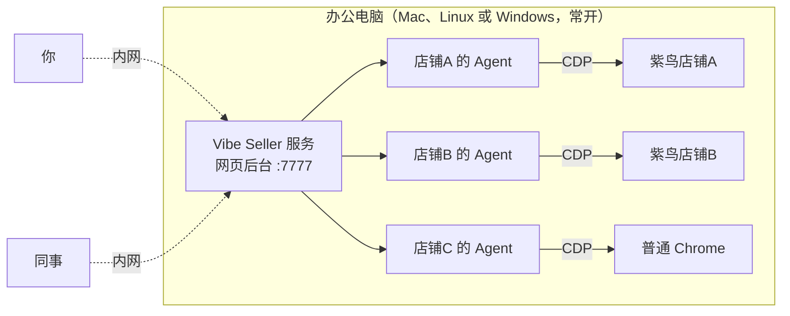

<h1 align="center">Vibe Seller</h1>

<p align="center">
  <b>跨境卖家专用的多店铺浏览器自动化框架</b><br/>
  支持 macOS、Linux、Windows（原生安装包）· 紫鸟、Chrome 多浏览器后端 · 自配 LLM API Key（支持 Claude / DeepSeek / GLM / Qwen / Kimi / MiniMax 等主流模型）
</p>

<p align="center">
  <a href="README.md">English</a> ·
  <a href="README.zh.md">中文</a>
</p>


<p align="center"></p>


---

## 这是什么

Vibe Seller 是给跨境卖家用的**浏览器自动化框架**，本地部署。
Agent 通过 CDP（Chrome 底层远程控制协议）驱动紫鸟（或普通
Chrome），跟你手动点页面一样
——广告调优、上架、Listing 巡检、库存检查、税票下载、建仓入
库、物流跟踪……凡是浏览器里能做的事，都能让 Agent 干。

每个店铺各跑各的——**就像你请了几个独立的运营**：店铺 A 的
Agent 只看店铺 A 的紫鸟档案，有它自己的记忆和工作区，跟店铺 B、
店铺 C 的 Agent 互不打扰、互不串数据。



两种部署方式都可以：

- **一台办公电脑常开着**，跑 Vibe Seller 服务和紫鸟（开发者模式）
- **或者就用自己的电脑**

你和同事在内网里用任意设备打开网页后台。

## 为什么用 Vibe Seller

比起现有的自动化工具，Vibe Seller 更贴近跨境卖家的实际需求，也
更贴近当下 AI 技术真正能做到的水平：从设计上就是 AI 驱动——内
置 Skill、多店铺隔离、全程本地部署。浏览器操作基于
[browser-use](https://github.com/browser-use/browser-use)，而不
是靠截图瞎点——比让 Agent 从零摸索页面快得多，也省 token 得
多。

- **原生紫鸟支持**——通过 CDP 直接控制紫鸟，不是裸 Chrome 跑
  Playwright，也不是 UI 坐标点击，所以风控风险低、稳定。
- **不挑浏览器**——除了紫鸟，普通 Chrome 也是一等公民，按店铺
  各自挑选。
- **支持大部分模型**——底层走 Claude Code CLI，凡是兼容
  Anthropic 协议的供应商都能接：Claude、DeepSeek、Kimi、MiniMax、
  智谱 GLM、通义千问。设置里切一下就行，不用改代码。Key 是你自
  己充的。
- **没有 SaaS 绑定**——代码在你机器上，数据在你硬盘里，不用
  注册账号。
- **可审计**——每一步操作、每条 Prompt、每张截图都有日志，可
  回放，出问题能溯源。
- **天然多店隔离**——每个店铺各有自己的平台、数据、SOP、积累
  下来的经验。店铺 A 跑 Amazon US，店铺 B 跑 Noon EG，店铺 C
  跑 Shopify 独立站——三个并行跑，互不串通。

## 安装

### 环境要求

- 任意一个 LLM API Key：Claude / DeepSeek / Kimi / MiniMax / GLM / Qwen
- 浏览器引擎——Chrome 或紫鸟

### 快速开始 —— 选你的系统

<details open>
<summary><b>🪟 Windows —— 原生安装包（推荐）</b></summary>

无需 WSL，无需配置 Python。在 **PowerShell** 里：

```powershell
irm https://raw.githubusercontent.com/zpoint/vibe-seller/main/installer/windows/install.ps1 | iex
```

或从 [最新 release](https://github.com/zpoint/vibe-seller/releases/latest) 下载 **`VibeSeller-Setup.exe`** 双击运行。

</details>

<details open>
<summary><b>🍎 macOS / 🐧 Linux</b></summary>

```bash
curl -sSL https://raw.githubusercontent.com/zpoint/vibe-seller/main/install.sh | bash
vibe-seller start
```

打开 <http://localhost:7777>。升级：`vibe-seller upgrade`。卸载：`uv tool uninstall vibe-seller`。

<sub>环境要求（<code>install.sh</code> 自动处理）：Python 3.11+（经 <a href="https://docs.astral.sh/uv/"><code>uv</code></a>）、Node.js 22+。</sub>

</details>

<details>
<summary>🪟 Windows 走 WSL2（进阶）</summary>

优先用上面的原生安装包。WSL2 方案是服务跑在 Ubuntu/WSL 里、浏览器在 Windows 宿主侧——需要 **mirrored 网络模式**（仅 Windows 11+ 支持）。完整步骤见 [开发者指南](docs/dev-guide.md)。

```bash
# 在 WSL2 Ubuntu 里
curl -sSL https://raw.githubusercontent.com/zpoint/vibe-seller/main/install.sh | bash
vibe-seller start
```

</details>

<details>
<summary>从源码 clone（贡献/二次开发用）</summary>

```bash
git clone https://github.com/zpoint/vibe-seller
cd vibe-seller
./install.sh --dev   # 装系统依赖 + venv + 编前端 + Playwright
./start.sh           # :7777 起服务
```

</details>

> `install.sh` 报错？把 GitHub 项目链接
> <https://github.com/zpoint/vibe-seller> 丢给任意 Coding Agent
> （Claude Code / Codex / opencode / Cursor 都行），让它「读一下
> README 帮我装」——它会自己看完文档、跑命令、绝大多数环境问题
> 一两条就能修好。

## 首次配置

<details>
<summary><b>🪟 Windows —— 首次配置（4 步）</b></summary>

刚用[原生安装包](#安装)装完的话，跟着这 4 步走：

### 1. 装上

跑 [`VibeSeller-Setup.exe`](https://github.com/zpoint/vibe-seller/releases/latest)（或上面 PowerShell 那行一键命令）。装完
会自动起服务——安装向导最后勾选**「现在打开 Vibe Seller」**，或者
自己打开 <http://localhost:7777>。

### 2. 填 LLM Key

`设置 → AI Agent` → 选一个供应商（DeepSeek 支持按 token 付费、
Claude 上限高、Kimi/MiniMax/GLM/通义都行），粘 API Key 保存。Key
本地加密存储。

> **没有 Key？** 最省事的是 [DeepSeek](https://platform.deepseek.com/)
> ——官网注册、充 15–20 块就能跑，按 token 付费（pay-as-you-go），
> 单次任务消耗看任务大小。其他家通常需要预付月卡 token 包，按自己
> 习惯买对应 plan 即可。

> 这台机器上的 Claude Code 已经登过 Anthropic 订阅？Vibe Seller
> 会直接复用那个会话，跳过这一步。


### 3. 绑定店铺

`设置 → 店铺 → 添加紫鸟账号`，填好账号、给每个店铺挑对应紫鸟档
案、保存。不用紫鸟可以选普通 Chrome。


### 4. 创建第一个任务

首页「新建任务」→ 挑店铺 → 写一句话告诉 Agent 干嘛：

- 「检查广告，把 ACOS 超过 30% 的关键词暂停掉」
- 「把过去 7 天销售报表导出来」
- 「看看库存，估算下个月要补哪些 SKU」

Agent 自己规划步骤、操作浏览器、最后给你一份结果报告。默认 Auto
模式，直接跑就行；任务详情底部可以切到 Plan 模式让它先把计划交
给你审。

> 还想接邮件 / 企业微信 / TickTick / Google Workspace？`设置 →
> 集成` 里随时都能配，不影响你先把第一个任务跑通。

</details>

<details>
<summary><b>🍎 macOS / 🐧 Linux —— 首次配置（8 步）</b></summary>

完全没碰过命令行也能跟着做。一共 8 步：

### 1. 打开终端

Mac 按 ⌘ + 空格，输入「终端」，回车。Linux 打开你平时用的终端应
用即可。

会出现一个黑底白字的窗口，里面有光标在闪——就是终端。

### 2. 装上

把下面整行**原样**复制，粘进终端，回车：

```bash
curl -sSL https://raw.githubusercontent.com/zpoint/vibe-seller/main/install.sh | bash
```

会自动跑几分钟（下载 Python 工具链、装 Vibe Seller、拉
Chromium）。看到最后写 `Vibe Seller installed!` 就成了。

中途卡住或者报错？把 GitHub 项目链接 <https://github.com/zpoint/vibe-seller>
丢给任意一个 Coding Agent（Claude Code、Codex、opencode、Cursor 都行），
告诉它「读 README 装一下这个」，它会自己跑命令帮你修。

### 3. 启动

```bash
vibe-seller start
```

服务会在后台跑起来，终端打印 PID 和日志路径就完事——可以关掉终端
窗口，服务不会停。需要停掉的时候用 `vibe-seller stop`。

### 4. 打开网页

浏览器输入：

```
http://localhost:7777
```

看到 Vibe Seller 首页就是装成功了（默认不需要登录）。

### 5. 填 LLM Key

`设置 → AI Agent` → 选一个供应商（DeepSeek 支持按 token 付费、
Claude 上限高、Kimi/MiniMax/GLM/通义都行），粘 API Key 保存。Key
本地加密存储。

> **没有 Key？** 最省事的是 [DeepSeek](https://platform.deepseek.com/)
> ——官网注册、充 15–20 块就能跑，按 token 付费（pay-as-you-go），
> 单次任务消耗看任务大小。其他家通常需要预付月卡 token 包，按自己
> 习惯买对应 plan 即可。

> 这台机器上的 Claude Code 已经登过 Anthropic 订阅？Vibe Seller
> 会直接复用那个会话，跳过这一步。

> **装了 cc-switch 之类的 Claude 账号切换工具？这里请选默认。**
>
> 这类工具直接改你的全局配置文件 `~/.claude/settings.json` 来切
> 换 AI 供应商，跟本项目自己的 AI 选择器会冲突。直接选默认就
> 行，AI 切换交给 cc-switch 管。
>
> 想反过来让本项目管的话：退出 cc-switch，然后在终端里**原样复
> 制粘贴**下面这一行回车——它会改你的 Claude Code 全局配置
> （`~/.claude/settings.json`），清掉 cc-switch 写进去的
> `ANTHROPIC_*` 环境变量：
>
> ```bash
> python3 -c "import json,pathlib;p=pathlib.Path.home()/'.claude'/'settings.json';d=json.loads(p.read_text());env=d.get('env') or {};[env.pop(k,None) for k in list(env) if k.startswith('ANTHROPIC_')];d['env']=env;p.write_text(json.dumps(d,indent=2))"
> ```


### 6. 绑定店铺

`设置 → 店铺 → 添加紫鸟账号`，填好账号、给每个店铺挑对应紫鸟档
案、保存。不用紫鸟可以选普通 Chrome。


### 7. （可选）配置邮件 / 企业微信

想让 Agent 每天出邮件巡检报告、把异常推到企业微信群？`设置 → 集成`
里加：

- **邮件**：填店铺对应邮箱地址，IMAP 服务器会自动识别（gmail /
  outlook / 自建都支持），你只用填 secrets（应用密码 / app
  password）。不知道怎么生成？把邮箱供应商名字问任意 AI 就行。
  保存后 Agent 每天自动扫一遍。
- **企业微信**：建群机器人，把 webhook URL 粘进来。重要异常自动
  推到群。
- **TickTick / Google Workspace**：要把结果同步到日程或文档的话，
  这里也能接。

跳过没关系，先把第一个任务跑通再说。

### 8. 创建第一个任务

首页「新建任务」→ 挑店铺 → 写一句话告诉 Agent 干嘛：

- 「检查广告，把 ACOS 超过 30% 的关键词暂停掉」
- 「把过去 7 天销售报表导出来」
- 「看看库存，估算下个月要补哪些 SKU」

Agent 自己规划步骤、操作浏览器、最后给你一份结果报告。默认 Auto
模式，直接跑就行；任务详情底部可以切到 Plan 模式让它先把计划交
给你审。

</details>

<details>
<summary><b>🐧 Windows 走 WSL2 —— 首次配置（8 步）</b></summary>

完全没碰过命令行也能跟着做。一共 8 步。前提是你已经按[ WSL2 方案
](#安装)装好了（需要 mirrored 网络模式，仅 Windows 11+ 支持）。

### 1. 打开终端

打开 WSL 里的 Ubuntu 终端——在开始菜单搜索「Ubuntu」，或者在
PowerShell 里输入 `wsl`。

会出现一个黑底白字的窗口，里面有光标在闪——就是终端。

### 2. 装上

把下面整行**原样**复制，粘进终端，回车：

```bash
curl -sSL https://raw.githubusercontent.com/zpoint/vibe-seller/main/install.sh | bash
```

会自动跑几分钟（下载 Python 工具链、装 Vibe Seller、拉
Chromium）。看到最后写 `Vibe Seller installed!` 就成了。

中途卡住或者报错？把 GitHub 项目链接 <https://github.com/zpoint/vibe-seller>
丢给任意一个 Coding Agent（Claude Code、Codex、opencode、Cursor 都行），
告诉它「读 README 装一下这个」，它会自己跑命令帮你修。

### 3. 启动

```bash
vibe-seller start
```

服务会在后台跑起来，终端打印 PID 和日志路径就完事——可以关掉终端
窗口，服务不会停。需要停掉的时候用 `vibe-seller stop`。

### 4. 打开网页

浏览器输入：

```
http://localhost:7777
```

看到 Vibe Seller 首页就是装成功了（默认不需要登录）。

### 5. 填 LLM Key

`设置 → AI Agent` → 选一个供应商（DeepSeek 支持按 token 付费、
Claude 上限高、Kimi/MiniMax/GLM/通义都行），粘 API Key 保存。Key
本地加密存储。

> **没有 Key？** 最省事的是 [DeepSeek](https://platform.deepseek.com/)
> ——官网注册、充 15–20 块就能跑，按 token 付费（pay-as-you-go），
> 单次任务消耗看任务大小。其他家通常需要预付月卡 token 包，按自己
> 习惯买对应 plan 即可。

> 这台机器上的 Claude Code 已经登过 Anthropic 订阅？Vibe Seller
> 会直接复用那个会话，跳过这一步。

> **装了 cc-switch 之类的 Claude 账号切换工具？这里请选默认。**
>
> 这类工具直接改你的全局配置文件 `~/.claude/settings.json` 来切
> 换 AI 供应商，跟本项目自己的 AI 选择器会冲突。直接选默认就
> 行，AI 切换交给 cc-switch 管。
>
> 想反过来让本项目管的话：退出 cc-switch，然后在终端里**原样复
> 制粘贴**下面这一行回车——它会改你的 Claude Code 全局配置
> （`~/.claude/settings.json`），清掉 cc-switch 写进去的
> `ANTHROPIC_*` 环境变量：
>
> ```bash
> python3 -c "import json,pathlib;p=pathlib.Path.home()/'.claude'/'settings.json';d=json.loads(p.read_text());env=d.get('env') or {};[env.pop(k,None) for k in list(env) if k.startswith('ANTHROPIC_')];d['env']=env;p.write_text(json.dumps(d,indent=2))"
> ```


### 6. 绑定店铺

`设置 → 店铺 → 添加紫鸟账号`，填好账号、给每个店铺挑对应紫鸟档
案、保存。不用紫鸟可以选普通 Chrome。

紫鸟装在 Windows 侧，Vibe Seller 跑在 WSL 里。紫鸟同一时间只能跑
一种模式，Vibe Seller 需要开发者模式（也叫 WebDriver 模式，这个
模式才会开 CDP）。WSL 这边没法直接重启 Windows 上的紫鸟，所以要
在 Windows 侧用启动器：

1. 从 `设置 → 店铺 → 下载启动器` 下载 `ziniao_webdriver.bat`。
2. 在 Windows 上双击运行。
3. 回到 WSL 里的 Vibe Seller，紫鸟页面点「**刷新**」按钮，账号
   自动出现，不用手填字段。


### 7. （可选）配置邮件 / 企业微信

想让 Agent 每天出邮件巡检报告、把异常推到企业微信群？`设置 → 集成`
里加：

- **邮件**：填店铺对应邮箱地址，IMAP 服务器会自动识别（gmail /
  outlook / 自建都支持），你只用填 secrets（应用密码 / app
  password）。不知道怎么生成？把邮箱供应商名字问任意 AI 就行。
  保存后 Agent 每天自动扫一遍。
- **企业微信**：建群机器人，把 webhook URL 粘进来。重要异常自动
  推到群。
- **TickTick / Google Workspace**：要把结果同步到日程或文档的话，
  这里也能接。

跳过没关系，先把第一个任务跑通再说。

### 8. 创建第一个任务

首页「新建任务」→ 挑店铺 → 写一句话告诉 Agent 干嘛：

- 「检查广告，把 ACOS 超过 30% 的关键词暂停掉」
- 「把过去 7 天销售报表导出来」
- 「看看库存，估算下个月要补哪些 SKU」

Agent 自己规划步骤、操作浏览器、最后给你一份结果报告。默认 Auto
模式，直接跑就行；任务详情底部可以切到 Plan 模式让它先把计划交
给你审。

</details>

## 能干什么

Vibe Seller 是个 **AI Agent 框架**，浏览器只是它的工具之一。
Agent 能浏览页面、读你的邮件、发企业微信、写滴答清单、改
Google Doc ——只要符合「看了 → 判断 → 操作」的活，能用浏览器
就走浏览器，能用集成接口就直接调接口。

跨境圈常见的几类场景：

| 任务 | Agent 干啥 |
|---|---|
| **广告调优** | 翻 Campaign Manager，找出花钱过多 / 不够的 Campaign，提出调价、调预算的建议，审批后一键应用。|
| **上架 Listing** | 按模板创建新 Listing：标题、卖点、图片、A+、变体一条龙。|
| **Listing 巡检** | 遍历所有店铺，标出下架 / 断货 / 异常的 SKU。|
| **库存检查** | 拉实时库存，低库存 SKU 直接推企微提醒。|
| **建仓 / 入库** | 创建入库单，分配 FBA / FBN，打印箱唛。|
| **物流数据查询** | 跟踪在途、查头程到货、清关进度；异常单自动写进滴答清单待办。|
| **税票 & 报表** | 抓税票库、Business Reports、广告报表；下完自动归档到 Google Drive。|
| **邮件处理** | 给买家邮件分类，重要的转企微，起草回复草稿。|
| **你想到的** | 写个 Skill（markdown 步骤说明），或者带 Agent 做一遍——它会自己记笔记，下次按你的习惯来。|

一次广告调优大概 3–5 分钟，LLM 费用约 ¥1（DeepSeek，看具体广
告数量浮动）。

## 集成的服务

除了浏览器，Agent 还能直接调用下面这些外部服务（首次配置里挂上
权限就行，不用写代码）：

| 服务 | 干啥 |
|---|---|
| **邮件**（IMAP/SMTP） | 读你绑定的店铺邮箱，分类、转发、起草回复 |
| **企业微信**（WeCom） | 推送重要事件、跨群通知、买家询盘转发 |
| **滴答清单 / TickTick** | 自动建待办（追单、跟进、定期检查） |
| **Google Workspace** | Gmail、Drive、Docs、Sheets、Slides、Calendar——读、写、改都行 |

一个任务可以同时用浏览器 + 这些服务。比如「找出所有店铺滞销的
SKU」可以这样跑：浏览器抓库存 → 生成 Google Sheet 报表 → 把摘要
发企微 → 在滴答清单里给你建个「下周降价」的待办。

## 支持的平台

### 内置 Skill 的平台

- **Amazon Seller Central**（US / EU / MENA 全部站点）
- **Noon Seller Lab**

这两个平台开发者亲自跑过、踩过坑，Skill 里把页面机制、导航路径、
UI 陷阱都写清楚了。Agent 读完 Skill + 你的任务 Prompt，常见操作
（查看广告、导出报表、调价、上架……）基本**一次就能跑通**。

### 其他浏览器能打开的电商后台

- 美客多（Mercado Libre）、速卖通（AliExpress）、Shopify
- Lazada、Shopee、TikTok Shop
- ……以及任何浏览器能打开的卖家后台。

开发者没有这些平台的测试账号，没法预先把机制写成 Skill。Agent
第一次在新平台上跑会有点跌跌撞撞，可能要试错几次才能摸清流程。

**但框架内置了「自我学习」**：Agent 在跑的过程中会自己做笔记
——点错的按钮、走通的路径、踩过的坑，都会自动存到该店铺的本
地知识库。整个过程**不需要你盯着**，Agent 自己跑、自己记。你
要是顺手给两句人工提示，那也一起记下。下次同样的任务，之前的
经验直接调用，不会再撞同一面墙。跑几轮之后，新平台的常见操作
也能稳定下来。

跑通之后欢迎你把经验整理成正式 Skill 反哺给项目（PR 通道见下面
「贡献代码」）。

## 服务管理

```bash
./start.sh          # 默认 :7777
./start.sh 8080     # 指定端口
./stop.sh           # 停止
./restart.sh        # 重启
```

要让同事在内网访问？让他们打开 `http://<你的电脑IP>:7777`。

## 常见问题

<details>
<summary><b>要花多少钱？</b></summary>

Vibe Seller 本身免费开源，花钱的只有你自己的 LLM API Key——直接
给供应商付费。粗略量级：用 DeepSeek 跑一次广告调优大概 ¥1。

</details>

<details>
<summary><b>该选哪个 LLM？</b></summary>

不同任务对模型推理能力的需求差很多，建议按任务类型挑：

| 任务类型 | 推荐模型 |
|---|---|
| **简单任务** —— 邮件分类、固定流程数据抽取、按字段填表 | MiniMax、Kimi、智谱 GLM、通义千问都行，挑便宜的 |
| **复杂任务** —— 探索新平台（没有内置 Skill）、广告优化、库存策略、跨页面长流程 | **建议 Claude 或 DeepSeek，别用便宜模型** |

为什么？复杂任务里 Agent 要边读 Skill、边判断页面状态、边调用
工具、边记笔记。便宜模型（比如 MiniMax 的低端档）在这种场景下
经常出现：

- 不按 Skill 步骤来，跳着走
- 工具调用参数错乱
- 长上下文里把前面的判断忘掉

另外一个常被忽视的点：**上下文窗口大小**。Claude 和 DeepSeek
v4 都是 1M 上下文，大多数其他模型在 200k 左右。跑一个复杂任务
时（多页表格、跨流程对话历史、累积下来的笔记），200k 很容易爆
——模型开始忘掉前面的判断、丢失细节，甚至直接出错。1M 上下文
跑同样的任务从容得多。

简单任务用什么模型差别不大，能省 token 就用便宜的；难任务上贵
模型不是奢侈、是必要——一次失败的复杂任务消耗的 token + 时间，
比直接用 SOTA 模型一次跑通要多得多。

</details>

<details>
<summary><b>不用紫鸟行吗？</b></summary>

看你要防什么。如果同一台机器要登多个同平台的卖家账号（比如好
几个 Amazon 店），平台会按浏览器指纹关联账号、一抓一个准——这
才是紫鸟要解决的问题。如果你每个店都在不同平台上，或者平台不
做指纹关联检测，普通 Chrome 完全够用，还能省掉紫鸟这一套配置。
已经在用紫鸟的话，直接接进来就行，不算额外成本。

</details>

<details>
<summary><b>紫鸟接入是怎么回事？开发者模式 vs 普通模式 / 需要的凭据 / 存哪</b></summary>

紫鸟同一时间只能跑一种模式：

- **普通模式**——你双击紫鸟图标启动的就是这个。只有 UI，给你
  日常手动用，外部程序进不来。
- **开发者模式（WebDriver）**——同一个紫鸟，启动时带了额外参数，
  会在 `127.0.0.1:16851` 开一个 HTTP API。这是 Vibe Seller（或者
  任何外部工具）能驱动紫鸟的**唯一**入口。

两个模式共用同一个紫鸟进程，不能同时跑。切换模式 = 重启紫鸟：

- **macOS**：Vibe Seller 自己来——打开店铺时它会先把普通模式
  的紫鸟杀掉，然后带 `--run_type=web_driver` 重新拉起。
- **Windows（WSL）**：WSL 这边没法跨虚拟机边界重启 Windows 上
  的紫鸟，所以 Windows 侧需要跑一个一行的 `.bat` 启动器（从
  `设置 → 店铺 → 下载启动器` 里下载）来完成杀掉 + 重启。双击
  跑一次就行，之后 Vibe Seller 通过「**刷新**」按钮就能识别到
  开发者模式的会话。

**需要的凭据**——在 `设置 → 店铺` 里加一个「紫鸟账号」，填三
个字段：

| 字段 | 是什么 |
|---|---|
| **公司名称** | 你的紫鸟企业账号公司标识 |
| **企业用户名** | 公司下面那个子账号的用户名 |
| **密码** | 那个子账号的密码 |

跟你平时登紫鸟用的是同一套——Vibe Seller 把这三个字段传给开发
者模式的 HTTP API，用来列出你的浏览器档案、启动会话。

**主账号（BOSS 账号）需要先在紫鸟开放平台开通开发者模式**（一次
性管理员配置，见 <https://open.ziniao.com/docSupport?docId=99>）。
没开通的话紫鸟会拒绝登录（报错 `statusCode: -10003`——紫鸟自己
的错误码，意思就是「这个公司没开通开发者模式」）。

**凭据存在哪**——全部在你本地 `~/.vibe-seller/data/vibe_seller.db`
（SQLite）。没有上传，遥测通道也不带走。

- **密码**：落盘前加密，密钥从你本地安装派生，任何 HTTP 接口都
  不会把密码返回给前端——只在 Vibe Seller 要调紫鸟 HTTP API 那
  一刻才在内存里解密。
- **公司名称** 和 **用户名**：明文存储——这俩是身份标识，跟邮箱
  地址一个性质。

让你填密码这件事是没办法的：紫鸟开发者模式的 HTTP API 走的就是
账号密码，没有 OAuth / token 替代。不能接受就走普通 Chrome：
`设置 → 店铺 → 添加 Chrome 店铺`。想看具体加密实现的可以翻
[`docs/dev-guide.md`](docs/dev-guide.md)。

</details>

<details>
<summary><b>绑定店铺时紫鸟提示「无权限通过 webdriver 登录」怎么办？</b></summary>

主账号（BOSS）还没给子账号开通 WebDriver 登录权限。按[紫鸟官方指南](https://open.ziniao.com/docSupport?docId=99#%E7%AC%AC%E4%B8%80%E6%AD%A5%EF%BC%9A%E7%99%BB%E5%BD%95%E5%BC%80%E6%94%BE%E5%B9%B3%E5%8F%B0%E6%8E%A7%E5%88%B6%E5%8F%B00)，在开放平台控制台里把 WebDriver 登录选项勾上：


只需要主账号操作一次，保存之后子账号就能通过 WebDriver 登录，
回到 Vibe Seller 点「刷新」就能绑上店铺。

</details>

<details>
<summary><b>绑定店铺时紫鸟提示「检测到您在新终端登录」怎么办？</b></summary>

这是紫鸟的新设备安全检测，不是 Vibe Seller 的问题。同一个账号
第一次在某台机器上登录时，紫鸟要求人工审批一次：

1. 在这台机器上手动打开紫鸟（普通模式，不是 WebDriver），用同
   一个子账号登录。
2. 紫鸟会弹出新设备提示——按提示提交审批申请。
3. 主账号（BOSS）到紫鸟后台批准这台设备。

批准之后这台设备就被信任了，回到 Vibe Seller 点「刷新」，
WebDriver 登录就能直接通过。

</details>

<details>
<summary><b>能不能跑在云服务器上？</b></summary>

不太行。Vibe Seller 本身是服务端没问题，但紫鸟需要桌面 GUI 才能
渲染。常见做法是办公室放一台桌面机——Mac mini、装了 WSL 的迷你
Windows 主机、或者一台闲置笔记本——团队通过内网连上去用。

</details>

<details>
<summary><b>我的店铺数据会不会泄露？</b></summary>

数据库、截图、日志全在你硬盘上的 `~/.vibe-seller/` 目录里。唯一
出本地的流量是你发给 LLM 供应商的 Prompt（包含 Agent 要读的页
面片段），其他什么都不外发。

</details>

<details>
<summary><b>Agent 的「记忆」存哪？</b></summary>

每个店铺的知识积累在 `~/.vibe-seller/stores/<店铺 slug>/` 下的
纯 markdown 文件里——你能看、能改、能在不同机器之间拷贝。Skill
也是 markdown。没有任何东西锁在二进制里。

</details>

## 文档

- [`docs/dev-guide.md`](docs/dev-guide.md) —— 完整功能说明、API、
  项目结构、测试流程
- [`DESIGN.md`](DESIGN.md) —— 架构设计
- [`docs/`](docs/) —— 各子系统的深入说明（浏览器、事件、调度、
  workspace 等）
- [`CLAUDE.md`](CLAUDE.md) —— Claude Code 在本仓库的协作规范

## 贡献代码

欢迎 PR——自己写代码、或者让 Claude Code / Cursor / 你顺手的
编程 Agent 来写都行。Python 侧 Google 风格（ruff 强制），前端
TypeScript 严格模式 + ESLint。[`CLAUDE.md`](CLAUDE.md) 是项目规
范文档——写给 AI Agent 看的，人读起来也清楚。

## License

[Apache License 2.0](LICENSE)。

## 联系作者

有问题欢迎邮件联系：<zp0int@qq.com>。
