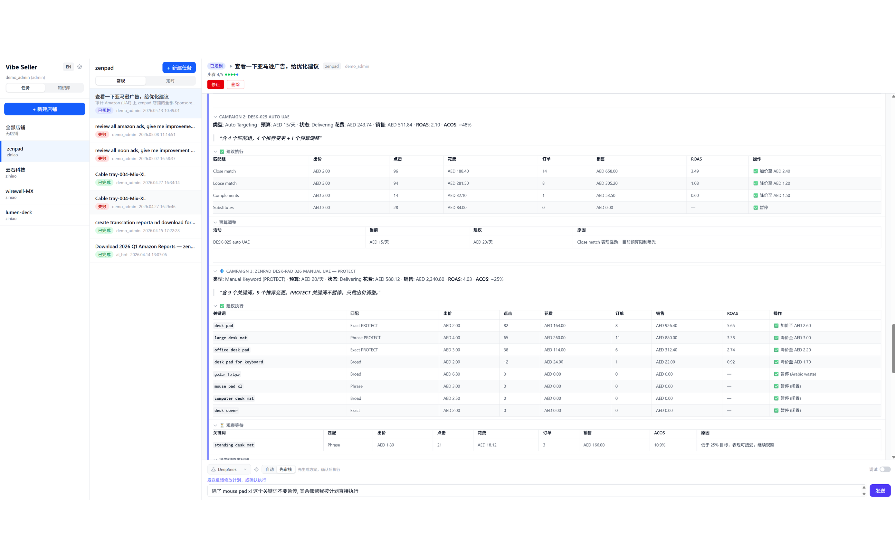
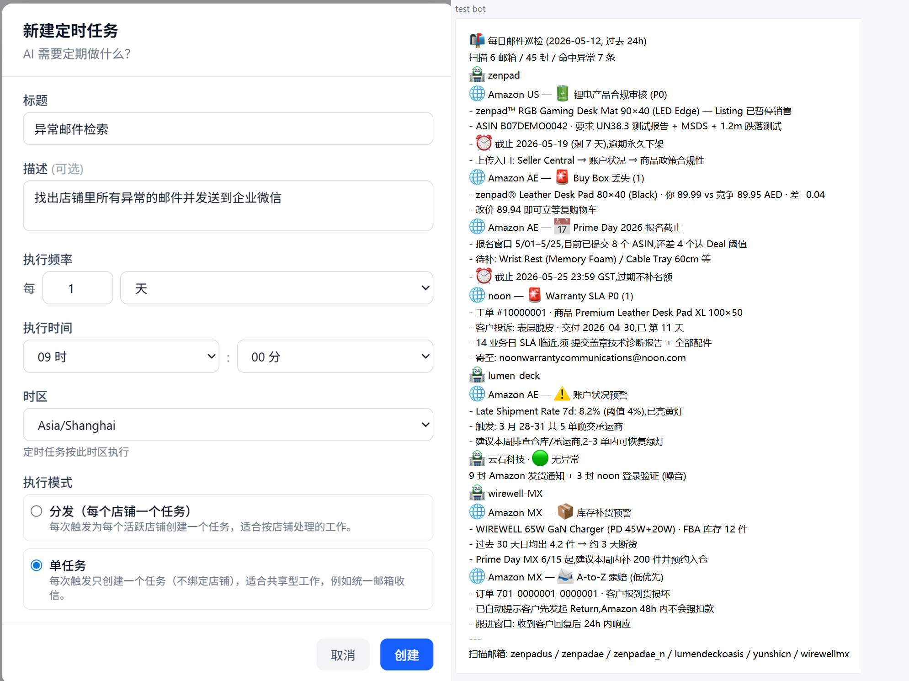
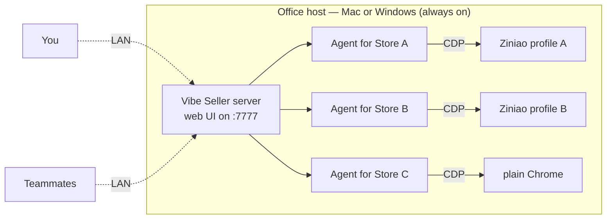
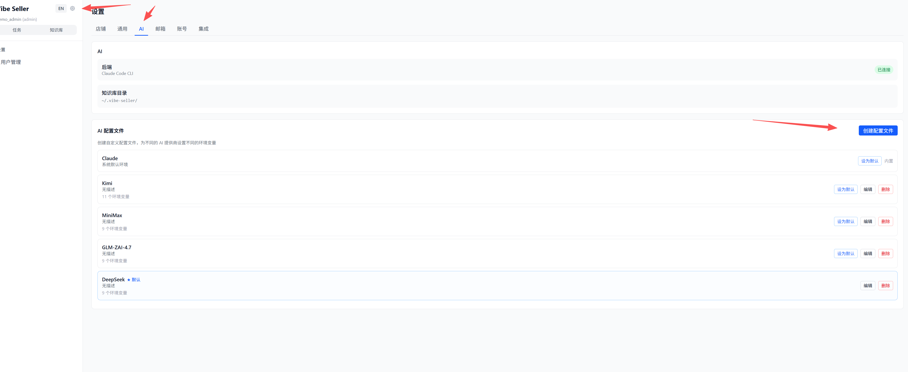
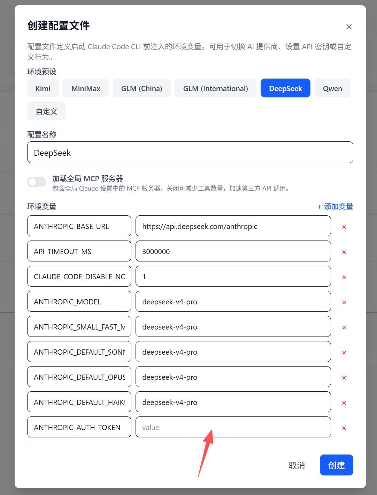
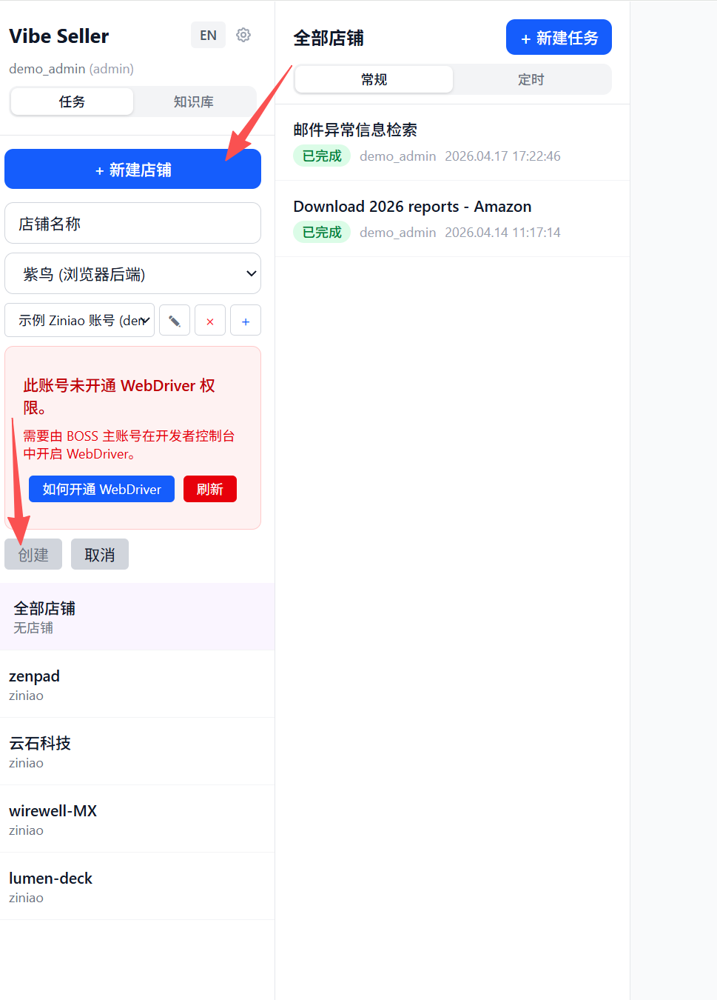
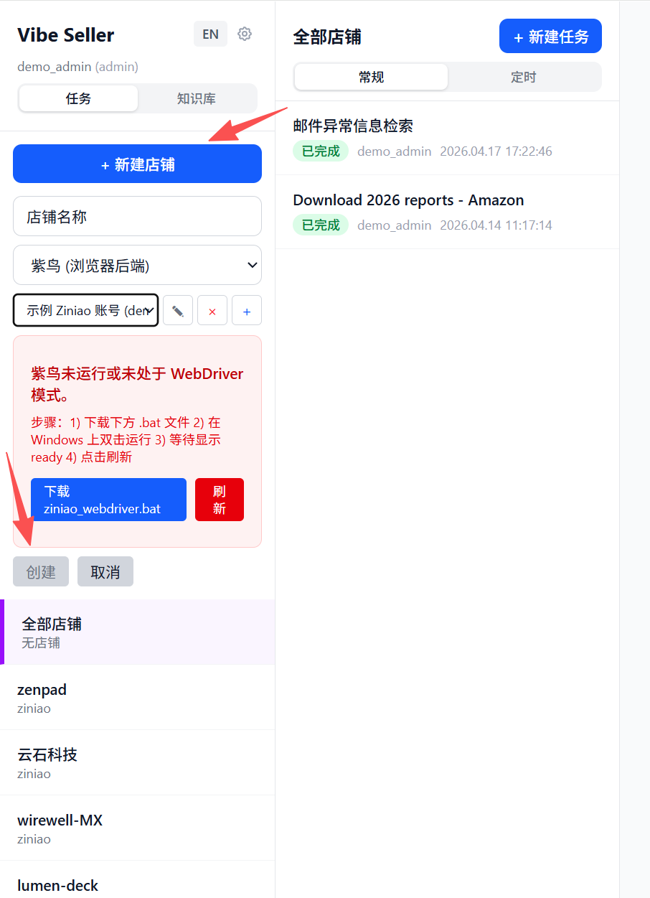

<h1 align="center">Vibe Seller</h1>

<p align="center">
  <b>AI automation framework for cross-border sellers (supports Amazon, Noon, Mercado Libre, Qianniu and more; Ziniao, Chrome and other browsers). Freely connect any LLM.</b><br/>
  Runs on macOS, Linux, or Windows (native installer). Local-first — code on your machine, data on your disk. Works with Claude, DeepSeek, GLM, Qwen, Kimi, MiniMax — any Anthropic-compatible provider.
</p>

<p align="center">
  <a href="README_en.md">English</a> ·
  <a href="README.md">中文</a>
</p>


<p align="center"></p>






---

## What is Vibe Seller?

A local-first **browser-automation framework**. AI agents drive your
real browser — Ziniao for fingerprint isolation, or plain Chrome —
through CDP (Chrome's low-level remote-control protocol), the same
way you'd click through pages yourself. Ad tuning, listing launches, inventory checks, invoicing,
returns, warehouse setup, logistics lookup — whatever you can do in
a browser, the agent can do too.

Each store gets its own agent — **think of it as hiring a different
ops person for each store**. The Store A agent only sees Store A's
profile, has its own memory and workspace, can't touch the other
stores' agents.



Either deployment works:

- **One always-on machine** (Mac, Linux, or Windows) hosts the
  server
- **Or just use your own computer**

You and your team open the web UI from any device on the same LAN.

## Why Vibe Seller?

Compared to existing automation tools, Vibe Seller is built around
what cross-border sellers actually need and what today's AI models
can actually do well: AI-driven by design, with built-in Skills,
per-store isolation, and fully local deployment. Browser control
runs on [browser-use](https://github.com/browser-use/browser-use)
instead of blind screenshot-clicking — faster, and far cheaper in
tokens, than an agent that has to feel out every page from
scratch.

- **Batteries-included, no hand-holding.** Amazon (every marketplace),
  Noon, and more ship with built-in Skills for the jobs sellers
  actually do — report / statement export, listing creation & updates,
  ad tuning. Create a task and the system opens the browser (Ziniao or
  Chrome) and the agent operates it directly — usually right on the
  first try, no step-by-step guidance needed.
- **Native Ziniao control.** CDP, not Playwright on vanilla Chrome,
  not UI-coordinate clicks. Lower risk-control risk, more stable.
- **Multi-browser by design.** Plain Chrome is a first-class backend
  alongside Ziniao — pick per store.
- **Multi-LLM by design.** Built on top of the Claude Code CLI, so
  any Anthropic-compatible provider works — Claude, DeepSeek, Kimi,
  MiniMax, GLM, Qwen. Switch in Settings, no code changes. Your key,
  your bill.
- **No SaaS lock-in.** Code on your machine, data on your disk, no
  account required.
- **Auditable.** Every step, every prompt, every screenshot is logged
  and replayable.
- **Multi-store from day one.** Each store keeps its own platform,
  data, SOPs, accumulated knowledge. Store A on Amazon US with its
  own listing strategy, Store B on Noon EG with totally different
  SOPs, Store C on Shopify DTC — they coexist without cross-talk.

## Install

### Prerequisites

- One LLM API key: Claude / DeepSeek / Kimi / MiniMax / GLM / Qwen
- A browser engine — Chrome or Ziniao

### Quick start — pick your OS

<details open>
<summary><b>🪟 Windows — native installer (recommended)</b></summary>

No WSL, no Python setup. Download **`VibeSeller-Setup.exe`** from the [latest release](https://github.com/zpoint/vibe-seller/releases/latest) and run it.

Or, in **PowerShell**:

```powershell
irm https://raw.githubusercontent.com/zpoint/vibe-seller/main/installer/windows/install.ps1 | iex
```

</details>

<details open>
<summary><b>🍎 macOS / 🐧 Linux</b></summary>

```bash
curl -sSL https://raw.githubusercontent.com/zpoint/vibe-seller/main/install.sh | bash
vibe-seller start
```

Open <http://localhost:7777>. Upgrade: `vibe-seller upgrade`. Uninstall: `uv tool uninstall vibe-seller`.

<sub>Prerequisites (auto-handled by <code>install.sh</code>): Python 3.11+ via <a href="https://docs.astral.sh/uv/"><code>uv</code></a>, Node.js 22+.</sub>

</details>

<details>
<summary>🪟 Windows via WSL2 (advanced)</summary>

Prefer the native installer above. The WSL2 path runs the server inside Ubuntu/WSL with the browser on the Windows host — it needs **mirrored networking** (Windows 11+). Full setup lives in the [developer guide](docs/dev-guide.md).

```bash
# inside WSL2 Ubuntu
curl -sSL https://raw.githubusercontent.com/zpoint/vibe-seller/main/install.sh | bash
vibe-seller start
```

</details>

<details>
<summary>From source (for contributors)</summary>

```bash
git clone https://github.com/zpoint/vibe-seller
cd vibe-seller
./install.sh --dev   # system deps + venv + frontend build + Playwright
./start.sh           # serves :7777
```

</details>

> If install fails, paste the repo URL
> <https://github.com/zpoint/vibe-seller> into any coding agent
> (Claude Code, Codex, opencode, Cursor) and tell it "read the
> README and install this." The README is written so any agent can
> follow it; most environment issues take one or two commands to fix.

## First run

<details>
<summary><b>🪟 Windows — first run (4 steps)</b></summary>

For anyone who just ran the [native installer](#install).

### 1. Install

Run [`VibeSeller-Setup.exe`](https://github.com/zpoint/vibe-seller/releases/latest)
(or the PowerShell one-liner from [Install](#install)). It starts
the server for you — check **Open Vibe Seller now** at the end of
the wizard, or open <http://localhost:7777> yourself.

### 2. Add your LLM key

`Settings → AI Agent` → pick a provider (DeepSeek bills per token,
Claude has the highest ceiling, Kimi / MiniMax / GLM / Qwen all
work), paste your API key, save. Keys are encrypted at rest.

> **No key yet?** [DeepSeek](https://platform.deepseek.com/) is
> the path of least resistance — sign up, top up $2–3,
> pay-as-you-go per token (cost per task scales with task size).
> The other providers usually sell prepaid monthly token packs;
> pick a plan that fits your usage.

> Already signed in to Anthropic via Claude Code on this machine?
> Vibe Seller reuses that session — skip this step.





### 3. Connect your stores

`Settings → Stores → Add Ziniao account`, fill in the account, pick
the right Ziniao profile for each store, save. Skip the Ziniao bit
and pick plain Chrome instead if you prefer.



### 4. Create your first task

Home page → **New task** → pick a store → write one sentence:

- "Check ads and pause any keyword with ACOS over 30%."
- "Export the past 7 days of sales reports."
- "Review inventory and estimate next month's restock SKUs."

The agent plans the steps, drives the browser, and writes you a
report. Auto mode is the default — just run it. The toggle in the
task footer can flip to Plan mode if you want to review the plan
before execution.

> Want email / WeCom / TickTick / Google Workspace hooked up too?
> `Settings → Integrations`, any time after install — optional, and
> doesn't block your first task.

</details>

<details>
<summary><b>🍎 macOS / 🐧 Linux — first run (8 steps)</b></summary>

For anyone who hasn't used a terminal before. Eight steps:

### 1. Open a terminal

⌘ + Space, type "Terminal", hit return (Mac). On Linux, open your
usual terminal app.

A black window appears with a blinking cursor.

### 2. Install

Copy this **entire line**, paste into the terminal, hit return:

```bash
curl -sSL https://raw.githubusercontent.com/zpoint/vibe-seller/main/install.sh | bash
```

Takes a few minutes (downloads the Python toolchain, installs
Vibe Seller, fetches Chromium). When the output ends with
`Vibe Seller installed!` you're set.

Stuck or hitting an error? Drop the repo URL
<https://github.com/zpoint/vibe-seller> into any coding agent
(Claude Code, Codex, opencode, Cursor) and say "read the README and
install this." The agent will work through it for you.

### 3. Start the server

```bash
vibe-seller start
```

The server daemonizes — the CLI prints the PID and log path and
exits. You can close the terminal; the server keeps running. To
stop it later: `vibe-seller stop`.

### 4. Open the web UI

In your browser:

```
http://localhost:7777
```

When the Vibe Seller home page loads, you're done (no login by
default).

### 5. Add your LLM key

`Settings → AI Agent` → pick a provider (DeepSeek bills per token,
Claude has the highest ceiling, Kimi / MiniMax / GLM / Qwen all
work), paste your API key, save. Keys are encrypted at rest.

> **No key yet?** [DeepSeek](https://platform.deepseek.com/) is
> the path of least resistance — sign up, top up $2–3,
> pay-as-you-go per token (cost per task scales with task size).
> The other providers usually sell prepaid monthly token packs;
> pick a plan that fits your usage.

> Already signed in to Anthropic via Claude Code on this machine?
> Vibe Seller reuses that session — skip this step.

> **Using cc-switch or a similar Claude-account-switcher tool? Pick
> the default here.**
>
> Those tools manage your AI provider by editing
> `~/.claude/settings.json` directly, which conflicts with Vibe
> Seller's own AI picker. Just pick the default here and let
> cc-switch keep managing which AI you use.
>
> If you'd rather Vibe Seller manage it instead: quit cc-switch,
> then **copy-paste this line into a terminal** and hit return —
> it edits your global Claude Code config
> (`~/.claude/settings.json`) to remove the `ANTHROPIC_*`
> environment variables cc-switch wrote there:
>
> ```bash
> python3 -c "import json,pathlib;p=pathlib.Path.home()/'.claude'/'settings.json';d=json.loads(p.read_text());env=d.get('env') or {};[env.pop(k,None) for k in list(env) if k.startswith('ANTHROPIC_')];d['env']=env;p.write_text(json.dumps(d,indent=2))"
> ```


### 6. Connect your stores

`Settings → Stores → Add Ziniao account`, fill in the account, pick
the right Ziniao profile for each store, save. Skip the Ziniao bit
and pick plain Chrome instead if you prefer.


### 7. (Optional) Wire up email / WeCom

Want the agent to do daily email triage and push critical items to a
group chat? `Settings → Integrations`:

- **Email**: enter the mailbox address for each store; the IMAP
  server fields auto-populate (gmail, outlook, self-hosted all
  supported), so all you fill in is the secret (an app password
  usually). Not sure how to generate one? Ask any AI with the name
  of your email provider. Agent scans daily afterwards.
- **WeCom (企业微信)**: set up a group bot, paste the webhook URL.
  High-priority anomalies post automatically.
- **TickTick / Google Workspace**: connect here if you want results
  synced into a calendar or Doc.

Skipping is fine — come back after your first task.

### 8. Create your first task

Home page → **New task** → pick a store → write one sentence:

- "Check ads and pause any keyword with ACOS over 30%."
- "Export the past 7 days of sales reports."
- "Review inventory and estimate next month's restock SKUs."

The agent plans the steps, drives the browser, and writes you a
report. Auto mode is the default — just run it. The toggle in the
task footer can flip to Plan mode if you want to review the plan
before execution.

</details>

<details>
<summary><b>🐧 Windows via WSL2 — first run (8 steps)</b></summary>

For anyone who hasn't used a terminal before. Eight steps. Assumes
you already installed via the [WSL2 path](#install) (mirrored
networking, Windows 11+).

### 1. Open a terminal

Open your WSL Ubuntu terminal — search "Ubuntu" in the Start menu,
or run `wsl` from PowerShell.

A black window appears with a blinking cursor.

### 2. Install

Copy this **entire line**, paste into the terminal, hit return:

```bash
curl -sSL https://raw.githubusercontent.com/zpoint/vibe-seller/main/install.sh | bash
```

Takes a few minutes (downloads the Python toolchain, installs
Vibe Seller, fetches Chromium). When the output ends with
`Vibe Seller installed!` you're set.

Stuck or hitting an error? Drop the repo URL
<https://github.com/zpoint/vibe-seller> into any coding agent
(Claude Code, Codex, opencode, Cursor) and say "read the README and
install this." The agent will work through it for you.

### 3. Start the server

```bash
vibe-seller start
```

The server daemonizes — the CLI prints the PID and log path and
exits. You can close the terminal; the server keeps running. To
stop it later: `vibe-seller stop`.

### 4. Open the web UI

In your browser:

```
http://localhost:7777
```

When the Vibe Seller home page loads, you're done (no login by
default).

### 5. Add your LLM key

`Settings → AI Agent` → pick a provider (DeepSeek bills per token,
Claude has the highest ceiling, Kimi / MiniMax / GLM / Qwen all
work), paste your API key, save. Keys are encrypted at rest.

> **No key yet?** [DeepSeek](https://platform.deepseek.com/) is
> the path of least resistance — sign up, top up $2–3,
> pay-as-you-go per token (cost per task scales with task size).
> The other providers usually sell prepaid monthly token packs;
> pick a plan that fits your usage.

> Already signed in to Anthropic via Claude Code on this machine?
> Vibe Seller reuses that session — skip this step.

> **Using cc-switch or a similar Claude-account-switcher tool? Pick
> the default here.**
>
> Those tools manage your AI provider by editing
> `~/.claude/settings.json` directly, which conflicts with Vibe
> Seller's own AI picker. Just pick the default here and let
> cc-switch keep managing which AI you use.
>
> If you'd rather Vibe Seller manage it instead: quit cc-switch,
> then **copy-paste this line into a terminal** and hit return —
> it edits your global Claude Code config
> (`~/.claude/settings.json`) to remove the `ANTHROPIC_*`
> environment variables cc-switch wrote there:
>
> ```bash
> python3 -c "import json,pathlib;p=pathlib.Path.home()/'.claude'/'settings.json';d=json.loads(p.read_text());env=d.get('env') or {};[env.pop(k,None) for k in list(env) if k.startswith('ANTHROPIC_')];d['env']=env;p.write_text(json.dumps(d,indent=2))"
> ```


### 6. Connect your stores

`Settings → Stores → Add Ziniao account`, fill in the account, pick
the right Ziniao profile for each store, save. Skip the Ziniao bit
and pick plain Chrome instead if you prefer.

Ziniao runs on the Windows side, Vibe Seller runs inside WSL. Ziniao
only runs one mode at a time, and Vibe Seller needs developer mode
(a.k.a. WebDriver mode — that's what exposes CDP). WSL can't
restart Windows-side Ziniao itself, so a launcher does it from
Windows:

1. Download `ziniao_webdriver.bat` from
   `Settings → Stores → Download launcher`.
2. Double-click it on Windows.
3. Back in WSL, hit **Refresh** on the Ziniao page in Vibe Seller —
   your accounts pop in automatically, no manual fields to fill.



### 7. (Optional) Wire up email / WeCom

Want the agent to do daily email triage and push critical items to a
group chat? `Settings → Integrations`:

- **Email**: enter the mailbox address for each store; the IMAP
  server fields auto-populate (gmail, outlook, self-hosted all
  supported), so all you fill in is the secret (an app password
  usually). Not sure how to generate one? Ask any AI with the name
  of your email provider. Agent scans daily afterwards.
- **WeCom (企业微信)**: set up a group bot, paste the webhook URL.
  High-priority anomalies post automatically.
- **TickTick / Google Workspace**: connect here if you want results
  synced into a calendar or Doc.

Skipping is fine — come back after your first task.

### 8. Create your first task

Home page → **New task** → pick a store → write one sentence:

- "Check ads and pause any keyword with ACOS over 30%."
- "Export the past 7 days of sales reports."
- "Review inventory and estimate next month's restock SKUs."

The agent plans the steps, drives the browser, and writes you a
report. Auto mode is the default — just run it. The toggle in the
task footer can flip to Plan mode if you want to review the plan
before execution.

</details>

## What you can do with it

Vibe Seller is an **AI agent framework** — the browser is one of
its tools, not the only one. The agent can browse pages, read your
email, send WeCom messages, write to TickTick / Dida365, update
Google Docs. Anything that fits *observe → decide → act* — whether
a browser is involved or not.

A few cross-border scenarios it's commonly used for:

| Task | What happens |
|---|---|
| **Ad tuning** | Reads Campaign Manager, finds under- and over-spenders, proposes bid / budget changes, applies them with your approval. |
| **Listing publication** | Creates new listings from a template — title, bullets, photos, A+ content, variations. |
| **Listing audit** | Walks every store's catalog, flags suppressed / out-of-stock / inactive items. |
| **Inventory check** | Pulls stock levels; low-stock SKUs get pushed to WeCom automatically. |
| **Warehouse / inbound setup** | Creates inbound shipments, allocates SKUs to FBA / FBN, prints box labels. |
| **Logistics lookup** | Tracks in-transit shipments, freight delivery, customs clearance; flagged shipments get filed as TickTick todos. |
| **Invoices & reports** | Crawls tax docs, business reports, advertising reports; downloads are archived to Google Drive. |
| **Email handling** | Sorts buyer messages, forwards important ones to WeCom, drafts replies. |
| **Anything you add** | Write a Skill (a markdown file with steps) or teach the agent once — it'll remember next time. |

A single ad-tuning run is ≈ 3–5 minutes and costs ≈ ¥1 in LLM tokens
(rough — depends on provider and campaign volume).

## Integrations

Beyond the browser, the agent can call these external services
directly (hook up permissions in First run — no code):

| Service | What it does |
|---|---|
| **Email** (IMAP/SMTP) | Read your bound store inboxes, classify, forward, draft replies |
| **WeCom** (企业微信) | Push important events, cross-group notifications, forward buyer inquiries |
| **TickTick / Dida365** | Auto-create todos (follow-ups, order tracking, periodic checks) |
| **Google Workspace** | Gmail, Drive, Docs, Sheets, Slides, Calendar — read, write, edit |

A single task can mix browser + service calls. e.g. *"Find all
slow-moving SKUs across stores"* → browser pulls inventory →
generates a Google Sheet → posts a WeCom summary → drops a "price
review next week" todo into TickTick.

## Platforms

### Built-in Skills

- **Amazon Seller Central** (every marketplace — US / EU / MENA, etc.)
- **Noon Seller Lab**

These are the platforms the project was dogfooded against. The
Skills capture page mechanics, navigation paths, UI gotchas. With
the Skill in hand, the agent typically completes common operations
(view ads, export reports, adjust bids, launch listings, ...) **on
the first try**.

### Anything else browser-based

- Mercado Libre (美客多), AliExpress (速卖通), Shopify
- Lazada, Shopee, TikTok Shop
- … and any other browser-accessible seller portal.

No pre-written Skill for these — the maintainers don't have test
accounts, so the mechanics aren't documented upfront. The agent
will fumble its first runs and need a few attempts to find the full
flow.

**The framework's built-in self-learning handles most of this on
its own.** As it runs, the agent takes notes — which button didn't
work, which path succeeded, which dead ends to avoid — and saves
them to that store's local knowledge. This happens **without you
needing to supervise**; the agent records its own mistakes as it
goes. Optional human hints get recorded too if you happen to drop
any. Next run, prior experience is pulled in automatically, so it
doesn't hit the same wall. After a few rounds, common operations
on a new platform stabilize.

Once you've ironed something out, please consider upstreaming it as
a proper Skill — see *Contributing* below.

## Running

```bash
./start.sh          # default :7777
./start.sh 8080     # custom port
./stop.sh           # stop
./restart.sh        # restart
```

To let teammates use the same instance, they open
`http://<your-host-ip>:7777` on the same LAN.

## FAQ

<details>
<summary><b>How much does it cost?</b></summary>

Vibe Seller is free and open source. You pay your LLM provider
directly. Rough scale: one ad-tuning run ≈ ¥1 in DeepSeek tokens.

</details>

<details>
<summary><b>Which LLM should I pick?</b></summary>

Different tasks need different model strength. Match the model to
the task:

| Task type | Recommended |
|---|---|
| **Simple** — email classification, fixed-flow data entry, structured extraction | MiniMax, Kimi, GLM, or Qwen — pick whatever's cheapest |
| **Complex** — exploring a new platform (no built-in Skill), ad optimization, inventory strategy, long multi-page flows | **Claude or DeepSeek. Don't use the cheap models here.** |

Why? Complex tasks ask the agent to read the Skill, judge page
state, call tools, and take notes — all in the same context window.
Cheap models (the low-tier MiniMax tiers especially) commonly:

- Skip Skill steps or run them out of order
- Garble tool-call arguments
- Forget earlier decisions once the context grows

One often-overlooked factor: **context window size.** Claude and
DeepSeek v4 ship with 1M context windows; most other models sit
around 200k. On a long task (multi-page tables, cross-flow
conversation history, accumulated notes), 200k fills up fast — the
model starts forgetting earlier decisions, dropping details, or
breaking outright. 1M handles the same task with room to spare.

For simple tasks, model choice barely matters; save tokens with a
cheap one. For hard tasks, paying for a SOTA model isn't a luxury —
it's the cheaper option once you count failed runs.

</details>

<details>
<summary><b>How does Ziniao integration actually work? Developer mode vs normal mode / credentials needed / where they're stored</b></summary>

Ziniao runs in exactly one mode at a time:

- **Normal mode** — what you get when you double-click the Ziniao
  icon. UI-only, designed for manual daily work. No remote control.
- **Developer mode (WebDriver)** — same Ziniao install, launched
  with extra flags so it exposes an HTTP API on
  `127.0.0.1:16851`. This is the only mode Vibe Seller (or any
  external tool) can drive.

The two modes share one Ziniao process, so they can't run side by
side. Switching requires restarting Ziniao.

- **macOS / native Windows**: Vibe Seller handles the swap itself —
  kills any normal-mode instance and relaunches with
  `--run_type=web_driver` when you open a store. Same automatic
  handling on both platforms, nothing for you to do.
- **Windows (WSL)**: WSL can't restart a Windows-side app across
  the VM boundary, so the Windows side runs a one-line `.bat`
  launcher (downloadable from `Settings → Stores → Download
  launcher`) that does the kill + relaunch. Double-click it once;
  Vibe Seller picks the developer-mode session up via Refresh.

**Credentials needed** — `Settings → Stores → Add Ziniao account`,
three fields:

| Field | What it is |
|---|---|
| **Company** (公司名称) | Your Ziniao enterprise company identifier |
| **Username** (企业用户名) | Sub-account username under that company |
| **Password** | That sub-account's password |

Same credentials you use to log into Ziniao — Vibe Seller passes
them to the developer-mode HTTP API to list your browsers and start
sessions.

The **BOSS account** also needs to enable developer mode for your
company on the Ziniao Open Platform (one-time admin setup, see
<https://open.ziniao.com/docSupport?docId=99>). Without it, Ziniao
rejects the login (`statusCode: -10003` — Ziniao's own error for
"developer mode isn't enabled for this company").

**Where credentials are stored** — all at
`~/.vibe-seller/data/vibe_seller.db` (local SQLite). No upload, no
telemetry path carries credentials out.

- **Password** is encrypted at rest with a key derived from your
  local install, and never returned by any HTTP endpoint —
  decrypted in memory only when Vibe Seller calls the Ziniao HTTP
  API.
- **Company** and **username** are plain strings — identifiers, not
  secrets (same shape as an email address).

Asking for the password is the necessary trade-off: developer-mode
auth requires it, no OAuth / token flow exists on the Ziniao side
today. If that's a deal-breaker, use plain Chrome instead
(`Settings → Stores → Add Chrome store`). Contributors curious about
the exact encryption implementation can check
[`docs/dev-guide.md`](docs/dev-guide.md).

</details>

<details>
<summary><b>Ziniao says "无权限通过 webdriver 登录" when I bind a store. How do I fix it?</b></summary>

The BOSS (admin) account hasn't enabled WebDriver login for your
sub-account yet. Follow [Ziniao's official guide](https://open.ziniao.com/docSupport?docId=99#%E7%AC%AC%E4%B8%80%E6%AD%A5%EF%BC%9A%E7%99%BB%E5%BD%95%E5%BC%80%E6%94%BE%E5%B9%B3%E5%8F%B0%E6%8E%A7%E5%88%B6%E5%8F%B00)
and tick the WebDriver-login option in the Open Platform console:


The admin (BOSS) account has to do this once. After it's saved,
your sub-account can log in via WebDriver and Vibe Seller will
bind the store on the next refresh.

</details>

<details>
<summary><b>Ziniao says "检测到您在新终端登录" and won't let me bind the store. How do I fix it?</b></summary>

This is Ziniao's new-device security check, not a Vibe Seller bug.
The first time a given machine logs into an account, Ziniao requires
a one-time manual approval:

1. Open Ziniao on this machine and log in manually (normal mode, not
   WebDriver) with the same sub-account credentials.
2. Ziniao will show a new-device prompt — submit the approval request.
3. Have the admin (BOSS) account approve the device in the Ziniao
   backend.

After that one-time approval the device is trusted, and Vibe Seller's
WebDriver login goes through on the next refresh.

</details>

<details>
<summary><b>Can I run it on a headless server?</b></summary>

Yes — you'll just need to solve the browser/GUI part yourself.
Vibe Seller itself runs fine on a headless server; Ziniao (and the
Chrome backend, if you want to watch it work) needs somewhere to
render into — a virtual display (Xvfb), a cloud desktop VM, or VNC
into a real GUI session all work. The simpler common setup, though,
is a small always-on desktop machine — a Mac mini, a mini-PC, a
spare laptop — that the team connects to over LAN.

</details>

<details>
<summary><b>What happens to my store data?</b></summary>

Everything — database, screenshots, logs — stays on your disk under
`~/.vibe-seller/`. The only outbound traffic is the prompts you send
to your LLM provider (which include whatever page snippets the agent
reads).

</details>

<details>
<summary><b>Where does the agent's "memory" live?</b></summary>

Per-store knowledge accumulates in `~/.vibe-seller/stores/<slug>/`
as plain markdown — you can read it, edit it, copy it between
machines. Skills are markdown too. Nothing is locked inside a
binary blob.

</details>

## Docs

- [`docs/dev-guide.md`](docs/dev-guide.md) — full feature reference,
  API, project structure, testing
- [`DESIGN.md`](DESIGN.md) — architecture
- [`docs/`](docs/) — subsystem deep-dives (browser, events,
  scheduling, workspace, etc.)
- [`CLAUDE.md`](CLAUDE.md) — contributor guide for Claude Code

## Contributing

PRs welcome — whether you write the code yourself or let Claude
Code / Cursor / your coding agent do it. Python side is Google
style (ruff-enforced); frontend is TypeScript strict + ESLint.
[`CLAUDE.md`](CLAUDE.md) is the project conventions doc — it's
written for AI agents and reads cleanly as a contributor guide.

## License

[Apache License 2.0](LICENSE).

## Contact

Questions or issues? Email the author at <zp0int@qq.com>.
